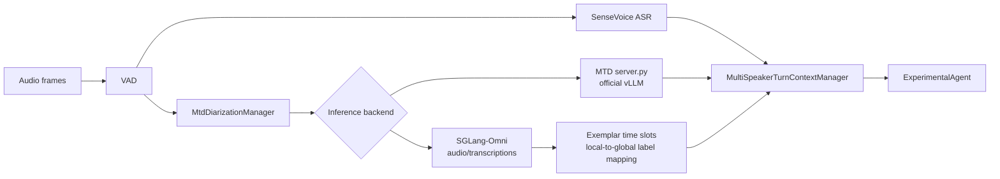

# MOSS Transcribe Diarize Multi-Speaker Integration

This document explains how to start the MOSS Transcribe Diarize (MTD) runtime and integrate it with X-Talk. The current implementation uses VAD to divide speech into segments. SenseVoice and MTD share the same `turn_id` and `segment_id`: ASR provides the accurate transcript, MTD provides timestamps and speaker labels, and both results are joined at the end of a turn before they are sent to the LLM.



The existing VAD path, MTD snapshot scheduler, speaker exemplar pool, event publication, and ASR/MTD join are identical for both backends. Switching backends only changes the `speaker_diarization` model configuration.

## 1. Choose an inference backend

### 1.1 Official vLLM runtime

The MTD runtime uses an official vLLM nightly wheel. The following command installs the verified official vLLM commit for a CUDA 12 environment:

```bash
uv pip install -U vllm \
  --torch-backend=auto \
  --extra-index-url \
  https://wheels.vllm.ai/68b4a1d582818e67adc903bf1b8fc5a5447da2fa/cu129
```

For a CUDA 13 environment, replace `cu129` at the end of the URL with `cu130`. Verify the installed version with:

```bash
python -c 'import importlib.metadata as m; print(m.version("vllm"))'
```

The verified version is:

```text
0.23.1rc1.dev949+g68b4a1d58
```

Prepare the official model weights:

```text
OpenMOSS-Team/MOSS-Transcribe-Diarize
```

### 1.2 SGLang-Omni

Deploy SGLang-Omni separately. X-Talk calls it over HTTP, so `sglang-omni` does not need to be installed in the X-Talk environment. After preparing a SGLang-Omni environment, serve the official checkpoint directly:

```bash
CUDA_VISIBLE_DEVICES=0 sgl-omni serve \
  --model-path OpenMOSS-Team/MOSS-Transcribe-Diarize \
  --port 18714 \
  --max-running-requests 1 \
  --cuda-graph-max-bs 1 \
  --mem-fraction-static 0.60
```

Check the service and send at least one short request to warm up the model:

```bash
curl http://127.0.0.1:18714/health

curl -X POST http://127.0.0.1:18714/v1/audio/transcriptions \
  -F model=OpenMOSS-Team/MOSS-Transcribe-Diarize \
  -F file=@warmup.wav \
  -F response_format=verbose_json \
  -F temperature=0 \
  -F max_new_tokens=2048
```

## 2. Start the official vLLM runtime

`scripts/mtd_runtime/server.py` loads the official vLLM `AsyncLLM` engine in its
own process. It also handles the fixed decoder prefix used for registered
speakers, parses timestamped output, and removes the exemplar time range from
the returned current-segment result. Do not start a separate `vllm serve`
process when using this entry point.

The runtime no longer wraps `LLM.generate()` with a global decode lock. Each
X-Talk session uses its own `OfficialMtdClient` HTTP session, while all requests
share one `AsyncLLM` engine for cross-session scheduling and dynamic batching.
The manager still processes snapshots sequentially inside one X-Talk session,
so its partial/final revision ordering is unchanged.

```bash
python scripts/mtd_runtime/server.py \
  --model OpenMOSS-Team/MOSS-Transcribe-Diarize \
  --host 127.0.0.1 \
  --port 18604 \
  --max-num-seqs 8
```

If the model has already been downloaded, replace `--model` with the local weights directory. Check the service after startup:

```bash
curl http://127.0.0.1:18604/health
```

`--max-num-seqs` limits the number of sequences scheduled by the engine at one
time. Tune it for the available GPU memory, maximum input length, and expected
concurrency. `/health` reports `active_requests` and the process-lifetime
`max_active_requests`, which make it possible to verify that concurrent HTTP
requests actually entered the engine. Cancellation invokes
`AsyncLLM.abort(request_id)` instead of merely discarding a result after decode
has completed.

## 3. Configure X-Talk

### 3.1 Official vLLM runtime

Merge the following sections from [`configs/mtd_multi_speaker.example.json`](../../configs/mtd_multi_speaker.example.json) into an existing X-Talk configuration:

- `speaker_diarization` configures `OfficialMtdClient` and the runtime URL.
- `service_config.multi_speaker` enables the multi-speaker path and response policy.
- `service_config.mtd` configures the partial interval, registration-audio silence, and exemplar quality rules.

Minimal configuration example:

```json
{
  "speaker_diarization": {
    "type": "OfficialMtdClient",
    "params": {
      "base_url": "http://127.0.0.1:18604",
      "request_timeout_s": 15.0,
      "temperature": 0.0,
      "max_tokens": 2048
    }
  },
  "service_config": {
    "multi_speaker": {
      "enabled": true,
      "response_policy": "all",
      "join_timeout_s": 5.0,
      "fallback_on_timeout": true
    },
    "mtd": {
      "audio_layout": {
        "inter_exemplar_silence_s": 0.5,
        "exemplar_to_current_silence_s": 1.0
      }
    }
  }
}
```

The current speaker-aware prompt is implemented by `ExperimentalAgent`, so the complete configuration should use that implementation as its LLM agent. Existing ASR, VAD, LLM, and TTS settings remain unchanged.

### 3.2 SGLang-Omni

Merge [`configs/mtd_multi_speaker_sglang_omni.example.json`](../../configs/mtd_multi_speaker_sglang_omni.example.json) into the existing configuration. Only the client type and service address differ:

```json
{
  "speaker_diarization": {
    "type": "SglangOmniMtdClient",
    "params": {
      "base_url": "http://127.0.0.1:18714",
      "model": "OpenMOSS-Team/MOSS-Transcribe-Diarize",
      "request_timeout_s": 15.0,
      "temperature": 0.0,
      "max_tokens": 2048,
      "exemplar_match_min_overlap_s": 0.05
    }
  }
}
```

The native SGLang-Omni transcription API does not accept a fixed decoder-completion prefix. `SglangOmniMtdClient` therefore preserves global speaker labels as follows:

1. `MtdDiarizationManager` still concatenates registered exemplar audio, configurable silence, and the current VAD snapshot into one request.
2. `decoder_prefix` still describes each exemplar time slot and its global speaker ID, but it is not submitted as a decoder completion prefix.
3. The client reads SGLang `verbose_json` timestamps and measures how long each request-local label overlaps each exemplar slot.
4. A one-to-one maximum-overlap match recovers the `request-local label -> session-global label` mapping.
5. The exemplar range is removed and current-audio timestamps are rebased to zero. An unmatched new speaker receives the next unused `Sxx`; `UNKNOWN` is never emitted.

`abort_on_vad_end` still cancels a locally waiting obsolete partial so the final can enter the manager worker promptly. The native transcription API does not currently expose a public request-ID cancellation endpoint, so this is best-effort HTTP-task cancellation.

## 4. Runtime behavior

1. `TurnTakingManager` assigns a `turn_id` and `segment_id` when VAD starts a segment.
2. SenseVoice and `MtdDiarizationManager` receive the audio frames for the same segment.
3. Within the VAD segment, MTD periodically submits a complete audio snapshot and publishes a replaceable partial result.
4. The vLLM backend preserves global labels with a fixed decoder prefix; the SGLang-Omni backend preserves them with exemplar-slot overlap mapping.
5. At VAD end, MTD submits a terminal segment final and uses high-quality audio from that result to update the speaker exemplar pool.
6. At the hard turn boundary, `MultiSpeakerTurnContextManager` joins the ASR final and MTD timeline by `turn_id`.
7. `ExperimentalAgent` receives the ASR transcript, speaker timeline, and active speaker together, allowing the LLM to understand who is speaking and remember speaker self-introductions.

The multi-speaker path is controlled by `service_config.multi_speaker.enabled`. When it is `false`, ASR finals continue through the original single-speaker path.

## 5. SGLang-Omni validation

The following path was validated on an RTX 4090 with real AISHELL-4 meeting audio:

- A direct 12-second request took about 236 ms end to end in the HTTP client.
- Full-snapshot partials at 0.8, 1.8, and 2.8 seconds took about 139, 99, and 145 ms; the 3.5-second final took about 132 ms.
- The first VAD final registered two speaker exemplars. A second VAD request containing those exemplars mapped its local output back to the existing global speaker IDs.
- `SpeakerDiarizationSegmentFinal`, `SpeakerDiarizationTurnFinal`, and `MultiSpeakerTurnReady` were all published normally, no `UNKNOWN` label appeared, and the final did not block.

These values were measured after server warmup. The first cold-start request should not be included in online-latency measurements.

## 6. AsyncLLM concurrency validation and backend-comparison scope

The following measurements used one RTX 4090, warmed-up service, 20-second
AISHELL-4 meeting-audio snapshots, and `--max-num-seqs 8`:

| Test | Serial wall time | AsyncLLM concurrent wall time | Concurrent per-request range | Result |
| --- | ---: | ---: | ---: | --- |
| 2 requests | 3.143 s | 1.582 s | 1.544–1.576 s | `max_active_requests=2` |
| 4 requests | 6.186 s | 1.891 s | 1.557–1.869 s | `max_active_requests=4` |
| 8 requests | 12.280 s | 1.885 s | 1.507–1.843 s | `max_active_requests=8` |

The eight-request run reached about 4.24 requests/s. Two real
`OfficialMtdClient.clone()` clients submitted concurrently in 1.606 seconds,
which verifies that the X-Talk session-clone path reaches the shared engine
concurrently. During a cancellation test, `DELETE` returned `202` in 1.5 ms,
the cancelled 120-second decode returned `409` at 0.478 seconds, and a
concurrent 20-second request still completed normally in 1.684 seconds.

To correct the scope of the earlier backend comparison, a second benchmark used
two identical RTX 4090 GPUs in the same machine, the same four distinct
20-second snapshots, the same prompt, `max_tokens=512`, and warmed-up services:

| Concurrency | AsyncLLM wall time | SGLang-Omni wall time | SGLang-Omni wall-time advantage |
| ---: | ---: | ---: | ---: |
| 4 serial requests | 6.162 s | 1.363 s | 4.52× |
| 2 requests | 1.563 s | 0.341 s | 4.59× |
| 4 requests | 1.800 s | 0.409 s | 4.40× |
| 8 requests | 1.827 s | 0.428 s | 4.27× |

The eight-request serial reference was 12.280 seconds for AsyncLLM and 2.622
seconds for SGLang-Omni. Three of the four raw outputs were byte-for-byte
identical. The remaining output differed only in its terminal timestamp,
`19.99` versus `19.98`; its transcript and speaker tags were identical. This
small test verifies runtime-output consistency, not dataset-level accuracy.

The earlier conclusion therefore needs a partial correction. SGLang-Omni still
has a substantial single-request and concurrent speed advantage under the
current deployment settings. The statement that different vLLM sessions are
serialized by a runtime-global lock is no longer true. AsyncLLM primarily fixes
cross-session queueing, batching, and real abort; it does not remove the
single-request kernel and graph-optimization gap between the engines. The
current vLLM run uses `enforce_eager`, while SGLang-Omni uses CUDA Graphs for
batch sizes 1/2/4/8. These numbers therefore describe the current recommended
deployment configurations rather than a framework-only microbenchmark with all
optimization variables removed.
