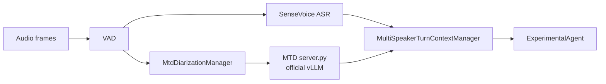

# MOSS Transcribe Diarize Multi-Speaker Integration

This document explains how to start the MOSS Transcribe Diarize (MTD) runtime and integrate it with X-Talk. The current implementation uses VAD to divide speech into segments. SenseVoice and MTD share the same `turn_id` and `segment_id`: ASR provides the accurate transcript, MTD provides timestamps and speaker labels, and both results are joined at the end of a turn before they are sent to the LLM.



## 1. Prepare the environment

The MTD runtime uses an official vLLM nightly wheel. The following command installs the verified official vLLM commit for a CUDA 12 environment:

```bash
uv pip install -U vllm \
  --torch-backend=auto \
  --extra-index-url \
  https://wheels.vllm.ai/68b4a1d582818e67adc903bf1b8fc5a5447da2fa/cu129
```

For a CUDA 13 environment, replace `cu129` at the end of the URL with `cu130`. Verify the installed version with:

```bash
python -c 'import importlib.metadata as m; print(m.version("vllm"))'
```

The verified version is:

```text
0.23.1rc1.dev949+g68b4a1d58
```

Prepare the official model weights:

```text
OpenMOSS-Team/MOSS-Transcribe-Diarize
```

## 2. Start the MTD runtime

`scripts/mtd_runtime/server.py` loads the official vLLM engine in its own process. It also handles the fixed decoder prefix used for registered speakers, parses timestamped output, and removes the exemplar time range from the returned current-segment result. Do not start a separate `vllm serve` process when using this entry point.

```bash
python scripts/mtd_runtime/server.py \
  --model OpenMOSS-Team/MOSS-Transcribe-Diarize \
  --host 127.0.0.1 \
  --port 18604
```

If the model has already been downloaded, replace `--model` with the local weights directory. Check the service after startup:

```bash
curl http://127.0.0.1:18604/health
```

## 3. Configure X-Talk

Merge the following sections from [`configs/mtd_multi_speaker.example.json`](../../configs/mtd_multi_speaker.example.json) into an existing X-Talk configuration:

- `speaker_diarization` configures `OfficialMtdClient` and the runtime URL.
- `service_config.multi_speaker` enables the multi-speaker path and response policy.
- `service_config.mtd` configures the partial interval, registration-audio silence, and exemplar quality rules.

Minimal configuration example:

```json
{
  "speaker_diarization": {
    "type": "OfficialMtdClient",
    "params": {
      "base_url": "http://127.0.0.1:18604",
      "request_timeout_s": 15.0,
      "temperature": 0.0,
      "max_tokens": 2048
    }
  },
  "service_config": {
    "multi_speaker": {
      "enabled": true,
      "response_policy": "all",
      "join_timeout_s": 5.0,
      "fallback_on_timeout": true
    },
    "mtd": {
      "audio_layout": {
        "inter_exemplar_silence_s": 0.5,
        "exemplar_to_current_silence_s": 1.0
      }
    }
  }
}
```

The current speaker-aware prompt is implemented by `ExperimentalAgent`, so the complete configuration should use that implementation as its LLM agent. Existing ASR, VAD, LLM, and TTS settings remain unchanged.

## 4. Runtime behavior

1. `TurnTakingManager` assigns a `turn_id` and `segment_id` when VAD starts a segment.
2. SenseVoice and `MtdDiarizationManager` receive the audio frames for the same segment.
3. Within the VAD segment, MTD periodically submits a complete audio snapshot and publishes a replaceable partial result.
4. At VAD end, MTD submits a terminal segment final and uses high-quality audio from that result to update the speaker exemplar pool.
5. At the hard turn boundary, `MultiSpeakerTurnContextManager` joins the ASR final and MTD timeline by `turn_id`.
6. `ExperimentalAgent` receives the ASR transcript, speaker timeline, and active speaker together, allowing the LLM to understand who is speaking and remember speaker self-introductions.

The multi-speaker path is controlled by `service_config.multi_speaker.enabled`. When it is `false`, ASR finals continue through the original single-speaker path.
