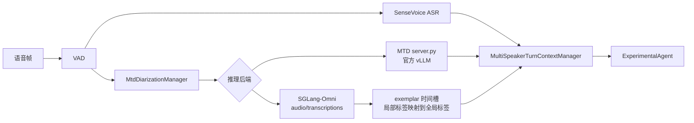

# MOSS Transcribe Diarize 多说话人接入

本文说明如何启动 MOSS Transcribe Diarize（MTD）服务，并将它接入 X-Talk。当前实现使用 VAD 划分语音片段，SenseVoice 和 MTD 共享同一组 `turn_id` 与 `segment_id`；ASR 提供准确文本，MTD 提供时间戳和说话人标签，二者在一轮结束后合并并发送给 LLM。



现有 VAD、MTD snapshot 调度、speaker exemplar pool、事件发布和 ASR/MTD 合并链路对两个后端完全相同。切换后端只需要替换 `speaker_diarization` 模型配置。

## 1. 选择推理后端

### 1.1 官方 vLLM runtime

MTD runtime 使用官方 vLLM nightly wheel。下面以 CUDA 12 环境为例，固定到已验证的官方 vLLM commit：

```bash
uv pip install -U vllm \
  --torch-backend=auto \
  --extra-index-url \
  https://wheels.vllm.ai/68b4a1d582818e67adc903bf1b8fc5a5447da2fa/cu129
```

CUDA 13 环境将地址末尾的 `cu129` 改为 `cu130`。安装完成后可以确认版本：

```bash
python -c 'import importlib.metadata as m; print(m.version("vllm"))'
```

已验证的版本为：

```text
0.23.1rc1.dev949+g68b4a1d58
```

准备官方模型权重：

```text
OpenMOSS-Team/MOSS-Transcribe-Diarize
```

### 1.2 SGLang-Omni

SGLang-Omni 独立部署，X-Talk 仅通过 HTTP 调用，不需要把 `sglang-omni` 安装进 X-Talk 环境。按 SGLang-Omni 的安装说明准备环境后，可以直接启动官方 MTD 权重：

```bash
CUDA_VISIBLE_DEVICES=0 sgl-omni serve \
  --model-path OpenMOSS-Team/MOSS-Transcribe-Diarize \
  --port 18714 \
  --max-running-requests 1 \
  --cuda-graph-max-bs 1 \
  --mem-fraction-static 0.60
```

服务启动后进行健康检查，并至少发送一次短音频请求完成模型 warmup：

```bash
curl http://127.0.0.1:18714/health

curl -X POST http://127.0.0.1:18714/v1/audio/transcriptions \
  -F model=OpenMOSS-Team/MOSS-Transcribe-Diarize \
  -F file=@warmup.wav \
  -F response_format=verbose_json \
  -F temperature=0 \
  -F max_new_tokens=2048
```

## 2. 启动官方 vLLM runtime

`scripts/mtd_runtime/server.py` 在进程内加载官方 vLLM engine，并额外处理注册说话人的固定 decoder prefix、时间戳解析和 exemplar 区间裁剪。使用该入口时不需要再单独执行 `vllm serve`。

```bash
python scripts/mtd_runtime/server.py \
  --model OpenMOSS-Team/MOSS-Transcribe-Diarize \
  --host 127.0.0.1 \
  --port 18604
```

如果权重已经下载到本地，可以将 `--model` 替换为权重目录。服务启动后检查健康状态：

```bash
curl http://127.0.0.1:18604/health
```

## 3. 配置 X-Talk

### 3.1 官方 vLLM runtime

将 [`configs/mtd_multi_speaker.example.json`](../../configs/mtd_multi_speaker.example.json) 中的以下配置合并进现有 X-Talk 配置：

- `speaker_diarization`：配置 `OfficialMtdClient` 和 runtime 地址。
- `service_config.multi_speaker`：启用多说话人链路和响应策略。
- `service_config.mtd`：配置 partial 间隔、注册音频静音以及 exemplar 质量规则。

核心配置示例：

```json
{
  "speaker_diarization": {
    "type": "OfficialMtdClient",
    "params": {
      "base_url": "http://127.0.0.1:18604",
      "request_timeout_s": 15.0,
      "temperature": 0.0,
      "max_tokens": 2048
    }
  },
  "service_config": {
    "multi_speaker": {
      "enabled": true,
      "response_policy": "all",
      "join_timeout_s": 5.0,
      "fallback_on_timeout": true
    },
    "mtd": {
      "audio_layout": {
        "inter_exemplar_silence_s": 0.5,
        "exemplar_to_current_silence_s": 1.0
      }
    }
  }
}
```

当前 speaker-aware prompt 由 `ExperimentalAgent` 处理，因此完整配置中的 LLM agent 应使用该实现。其他 ASR、VAD、LLM 和 TTS 配置保持原有方式。

### 3.2 SGLang-Omni

将 [`configs/mtd_multi_speaker_sglang_omni.example.json`](../../configs/mtd_multi_speaker_sglang_omni.example.json) 合并进现有配置。核心差别仅是客户端类型和服务地址：

```json
{
  "speaker_diarization": {
    "type": "SglangOmniMtdClient",
    "params": {
      "base_url": "http://127.0.0.1:18714",
      "model": "OpenMOSS-Team/MOSS-Transcribe-Diarize",
      "request_timeout_s": 15.0,
      "temperature": 0.0,
      "max_tokens": 2048,
      "exemplar_match_min_overlap_s": 0.05
    }
  }
}
```

SGLang-Omni 的原生 transcription API 不接收固定 decoder completion prefix，因此 `SglangOmniMtdClient` 使用以下方式保持全局说话人标签：

1. `MtdDiarizationManager` 仍然把已注册 exemplar 音频、可配置静音和当前 VAD snapshot 拼成同一个请求。
2. `decoder_prefix` 仍描述每个 exemplar 在请求音频中的时间槽及其全局 speaker ID，但不直接提交给 SGLang decoder。
3. 客户端读取 SGLang `verbose_json` 的时间戳，计算每个本轮局部 speaker label 与各 exemplar 时间槽的重叠时长。
4. 使用一对一最大重叠匹配恢复 `本轮局部标签 -> 会话全局标签`。
5. 裁掉 exemplar 区域，将当前 VAD 区域的时间戳归零；未匹配的新说话人分配未占用的 `Sxx`，不会产生 `UNKNOWN`。

`abort_on_vad_end` 仍会及时取消客户端等待中的旧 partial，让 final 优先进入 manager worker。原生 transcription API 暂无公开的远端 request-ID cancel 接口，因此这是 HTTP 任务级的 best-effort cancel。

## 4. 运行机制

1. `TurnTakingManager` 在 VAD start 时分配 `turn_id` 和 `segment_id`。
2. SenseVoice 与 `MtdDiarizationManager` 同时接收该片段的语音帧。
3. MTD 在 VAD 片段内周期性提交完整 audio snapshot，并发布可替换的 partial。
4. 选择 vLLM 时由固定 decoder prefix 保持全局标签；选择 SGLang-Omni 时由 exemplar 时间槽重叠映射保持全局标签。
5. VAD end 后提交不可替换的 segment final，并使用其中的高质量音频更新 speaker exemplar pool。
6. 硬轮次结束后，`MultiSpeakerTurnContextManager` 按 `turn_id` 合并 ASR final 和 MTD timeline。
7. `ExperimentalAgent` 同时接收 ASR 文本、speaker timeline 和 active speaker，用于理解谁在说话并记忆说话人自报信息。

多说话人功能由 `service_config.multi_speaker.enabled` 控制。设置为 `false` 时，ASR final 继续沿用原有单说话人链路。

## 5. SGLang-Omni 实测结果

在 RTX 4090 上使用 AISHELL-4 真实会议音频验证了以下链路：

- 12 秒音频直接调用：端到端 HTTP client 时延约 236 ms。
- VAD 内 full-snapshot partial：0.8、1.8、2.8 秒 snapshot 分别约为 139、99、145 ms，3.5 秒 final 约为 132 ms。
- 第一个 VAD final 成功注册两个 speaker exemplar；第二个 VAD 请求携带这些 exemplar 后，仍能映射回已有全局 speaker ID。
- `SpeakerDiarizationSegmentFinal`、`SpeakerDiarizationTurnFinal` 和 `MultiSpeakerTurnReady` 均正常发布，没有出现 `UNKNOWN`，final 没有阻塞。

上述结果是在服务完成 warmup 后测得。冷启动首次请求不应计入在线时延。
