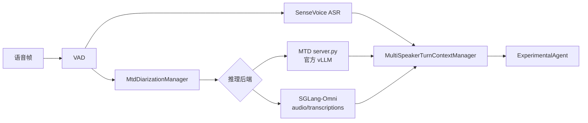

# MOSS Transcribe Diarize 多说话人接入

本文说明如何启动 MOSS Transcribe Diarize（MTD）服务，并将它接入 X-Talk。当前实现使用 VAD 划分语音片段，SenseVoice 和 MTD 共享同一组 `turn_id` 与 `segment_id`；ASR 提供准确文本，MTD 提供时间戳和说话人标签，二者在一轮结束后合并并发送给 LLM。



现有 VAD、MTD snapshot 调度、speaker exemplar pool、事件发布和 ASR/MTD 合并链路对两个后端完全相同。切换后端只需要替换 `speaker_diarization` 模型配置。

## 1. 选择推理后端

### 1.1 官方 vLLM runtime

MTD runtime 使用官方 vLLM nightly wheel。下面以 CUDA 12 环境为例，固定到已验证的官方 vLLM commit：

```bash
uv pip install -U vllm \
  --torch-backend=auto \
  --extra-index-url \
  https://wheels.vllm.ai/68b4a1d582818e67adc903bf1b8fc5a5447da2fa/cu129
```

CUDA 13 环境将地址末尾的 `cu129` 改为 `cu130`。安装完成后可以确认版本：

```bash
python -c 'import importlib.metadata as m; print(m.version("vllm"))'
```

已验证的版本为：

```text
0.23.1rc1.dev949+g68b4a1d58
```

准备官方模型权重：

```text
OpenMOSS-Team/MOSS-Transcribe-Diarize
```

### 1.2 SGLang-Omni

SGLang-Omni 独立部署，X-Talk 仅通过 HTTP 调用，不需要把 `sglang-omni` 安装进 X-Talk 环境。按 SGLang-Omni 的安装说明准备环境后，可以直接启动官方 MTD 权重：

```bash
CUDA_VISIBLE_DEVICES=0 sgl-omni serve \
  --model-path OpenMOSS-Team/MOSS-Transcribe-Diarize \
  --port 18714 \
  --max-running-requests 1 \
  --cuda-graph-max-bs 1 \
  --mem-fraction-static 0.60
```

服务启动后进行健康检查，并至少发送一次短音频请求完成模型 warmup：

```bash
curl http://127.0.0.1:18714/health

curl -X POST http://127.0.0.1:18714/v1/audio/transcriptions \
  -F model=OpenMOSS-Team/MOSS-Transcribe-Diarize \
  -F file=@warmup.wav \
  -F response_format=verbose_json \
  -F temperature=0 \
  -F max_new_tokens=2048
```

## 2. 启动官方 vLLM runtime

`scripts/mtd_runtime/server.py` 在进程内加载官方 vLLM `AsyncLLM`
engine，并额外处理注册说话人的固定 decoder prefix、时间戳解析和
exemplar 区间裁剪。使用该入口时不需要再单独执行 `vllm
serve`。

runtime 不再用全局 decode lock 包住 `LLM.generate()`。不同 X-Talk session
使用各自的 `OfficialMtdClient` HTTP session，但请求共享同一个
`AsyncLLM` engine，由 vLLM 进行跨 session 调度和动态 batching。单个
X-Talk session 内的 manager 仍按顺序处理 snapshot，因此 partial/final revision
顺序不变。

```bash
python scripts/mtd_runtime/server.py \
  --model OpenMOSS-Team/MOSS-Transcribe-Diarize \
  --host 127.0.0.1 \
  --port 18604 \
  --max-num-seqs 8
```

如果权重已经下载到本地，可以将 `--model` 替换为权重目录。服务启动后检查健康状态：

```bash
curl http://127.0.0.1:18604/health
```

`--max-num-seqs` 限制同时由 engine 调度的 sequence 数，应根据 GPU
显存、最大输入长度和实际并发量调整。`/health` 返回
`active_requests` 和进程生命周期内的 `max_active_requests`，可用于确认
并发请求确实进入 engine。取消请求时，runtime 会调用
`AsyncLLM.abort(request_id)`，而不只是在解码完成后丢弃结果。

## 3. 配置 X-Talk

### 3.1 官方 vLLM runtime

将 [`configs/mtd_multi_speaker.example.json`](../../configs/mtd_multi_speaker.example.json) 中的以下配置合并进现有 X-Talk 配置：

- `speaker_diarization`：配置 `OfficialMtdClient` 和 runtime 地址。
- `service_config.multi_speaker`：启用多说话人链路和响应策略。
- `service_config.mtd`：配置 partial 间隔、注册音频静音以及 exemplar 质量规则。

核心配置示例：

```json
{
  "speaker_diarization": {
    "type": "OfficialMtdClient",
    "params": {
      "base_url": "http://127.0.0.1:18604",
      "request_timeout_s": 15.0,
      "temperature": 0.0,
      "max_tokens": 2048
    }
  },
  "service_config": {
    "multi_speaker": {
      "enabled": true,
      "response_policy": "all",
      "join_timeout_s": 5.0,
      "fallback_on_timeout": true
    },
    "mtd": {
      "audio_layout": {
        "inter_exemplar_silence_s": 0.5,
        "exemplar_to_current_silence_s": 1.0
      }
    }
  }
}
```

当前 speaker-aware prompt 由 `ExperimentalAgent` 处理，因此完整配置中的 LLM agent 应使用该实现。其他 ASR、VAD、LLM 和 TTS 配置保持原有方式。

### 3.2 SGLang-Omni

将 [`configs/mtd_multi_speaker_sglang_omni.example.json`](../../configs/mtd_multi_speaker_sglang_omni.example.json) 合并进现有配置。核心差别仅是客户端类型和服务地址：

```json
{
  "speaker_diarization": {
    "type": "SglangOmniMtdClient",
    "params": {
      "base_url": "http://127.0.0.1:18714",
      "model": "OpenMOSS-Team/MOSS-Transcribe-Diarize",
      "request_timeout_s": 15.0,
      "temperature": 0.0,
      "max_tokens": 2048
    }
  }
}
```

`SglangOmniMtdClient` 现在与 vLLM runtime 一样使用固定 decoder prefix。SGLang-Omni 的 prompt 处理器本来就会原样保留包含 `<|audio_pad|>` 的完整 prompt；因此 X-Talk 自行构造完整 MTD chat template，并将 `decoder_prefix` 直接接在 assistant header 后。无需改动 SGLang-Omni 服务端、模型或源码。

1. `MtdDiarizationManager` 将已注册 exemplar 音频、可配置静音和当前 VAD snapshot 拼成同一个请求。
2. 时间戳形式的 `decoder_prefix` 被接在 `<|im_start|>assistant` 后，注册的 `S01` / `S02` 标签成为固定的 decoder 上下文。
3. SGLang 只返回新生成的后缀；客户端将后缀和本地已知的 prefix 拼回完整文本，解析完整时间线，裁掉 exemplar 区间后将当前音频时间戳归零。
4. 客户端直接保留 fixed-prefix continuation 输出的 speaker label，不再做 exemplar 时间槽重叠映射，也不再重新分配标签。

`abort_on_vad_end` 仍会及时取消客户端等待中的旧 partial，让 final 优先进入 manager worker。原生 transcription API 暂无公开的远端 request-ID cancel 接口，因此这是 HTTP 任务级的 best-effort cancel。

## 4. 运行机制

1. `TurnTakingManager` 在 VAD start 时分配 `turn_id` 和 `segment_id`。
2. SenseVoice 与 `MtdDiarizationManager` 同时接收该片段的语音帧。
3. MTD 在 VAD 片段内周期性提交完整 audio snapshot，并发布可替换的 partial。
4. vLLM 和 SGLang-Omni 均使用固定 decoder prefix 保持全局标签。
5. VAD end 后提交不可替换的 segment final，并使用其中的高质量音频更新 speaker exemplar pool。
6. 硬轮次结束后，`MultiSpeakerTurnContextManager` 按 `turn_id` 合并 ASR final 和 MTD timeline。
7. `ExperimentalAgent` 同时接收 ASR 文本、speaker timeline 和 active speaker，用于理解谁在说话并记忆说话人自报信息。

多说话人功能由 `service_config.multi_speaker.enabled` 控制。设置为 `false` 时，ASR final 继续沿用原有单说话人链路。

## 5. SGLang-Omni 实测结果

在 RTX 4090 上使用 AISHELL-4 真实会议音频验证了以下链路：

- 12 秒音频直接调用：端到端 HTTP client 时延约 236 ms。
- VAD 内 full-snapshot partial：0.8、1.8、2.8 秒 snapshot 分别约为 139、99、145 ms，3.5 秒 final 约为 132 ms。
- 第一个 VAD final 成功注册两个 speaker exemplar；第二个 VAD 请求将它们作为音频和固定时间戳 decoder prefix 一并提交。
- `SpeakerDiarizationSegmentFinal`、`SpeakerDiarizationTurnFinal` 和 `MultiSpeakerTurnReady` 均正常发布，没有出现 `UNKNOWN`，final 没有阻塞。

上述结果是在服务完成 warmup 后测得。冷启动首次请求不应计入在线时延。

## 6. AsyncLLM 并发验证与后端对比口径

在单张 RTX 4090 上，使用 20 秒 AISHELL-4 会议音频快照、
`--max-num-seqs 8` 和已 warmup 服务实测：

| 测试 | 串行 wall time | AsyncLLM 并发 wall time | 并发时单请求范围 | 结果 |
| --- | ---: | ---: | ---: | --- |
| 2 路 | 3.143 s | 1.582 s | 1.544–1.576 s | `max_active_requests=2` |
| 4 路 | 6.186 s | 1.891 s | 1.557–1.869 s | `max_active_requests=4` |
| 8 路 | 12.280 s | 1.885 s | 1.507–1.843 s | `max_active_requests=8` |

8 路时吞吐约为 4.24 requests/s。两个真实
`OfficialMtdClient.clone()` 客户端同时提交请求的 wall time 为 1.606 s，
说明 X-Talk 的 session clone 链路也能进入同一 engine 并发执行。取消一个
120 秒请求时，`DELETE` 在 1.5 ms 内返回 `202`，被取消的 decode
在 0.478 s 时返回 `409`，同时运行的 20 秒请求仍在 1.684 s 正常完成。

为了修正原后端对比口径，又在同一台机器的两张同型号 RTX 4090 上，
固定相同的 4 段 20 秒音频、相同 prompt、`max_tokens=512` 和 warmup
状态，分别运行 AsyncLLM 与 SGLang-Omni：

| 并发度 | AsyncLLM wall time | SGLang-Omni wall time | SGLang-Omni wall-time 优势 |
| ---: | ---: | ---: | ---: |
| 串行 4 路 | 6.162 s | 1.363 s | 4.52× |
| 2 路 | 1.563 s | 0.341 s | 4.59× |
| 4 路 | 1.800 s | 0.409 s | 4.40× |
| 8 路 | 1.827 s | 0.428 s | 4.27× |

8 路串行的参考值为 AsyncLLM 12.280 s、SGLang-Omni 2.622 s。四段
音频中三段的 raw output 完全相同；剩余一段仅有末尾时间戳
`19.99` 与 `19.98` 的 10 ms 差异，转录文本和 speaker tag 一致。这只能用于
验证本次 runtime 改造的输出一致性，不是数据集级准确率评测。

因此，旧结论需要局部修正：SGLang-Omni 在当前部署参数下的单请求与并发
速度优势仍然成立；“vLLM 的不同 session 会被 runtime 全局锁串行化”已不再
成立。AsyncLLM 解决的主要是跨 session 排队、batching 和真正 abort，它没有
消除两个引擎的单请求算子与图优化差距。当前 vLLM 测试启用
`enforce_eager`，SGLang-Omni 则使用 batch 1/2/4/8 CUDA Graph，所以这组数字代表
当前推荐部署配置，不是排除所有优化变量后的纯框架微基准。
