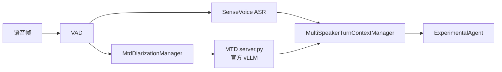

# MOSS Transcribe Diarize 多说话人接入

本文说明如何启动 MOSS Transcribe Diarize（MTD）服务，并将它接入 X-Talk。当前实现使用 VAD 划分语音片段，SenseVoice 和 MTD 共享同一组 `turn_id` 与 `segment_id`；ASR 提供准确文本，MTD 提供时间戳和说话人标签，二者在一轮结束后合并并发送给 LLM。



## 1. 准备环境

MTD runtime 使用官方 vLLM nightly wheel。下面以 CUDA 12 环境为例，固定到已验证的官方 vLLM commit：

```bash
uv pip install -U vllm \
  --torch-backend=auto \
  --extra-index-url \
  https://wheels.vllm.ai/68b4a1d582818e67adc903bf1b8fc5a5447da2fa/cu129
```

CUDA 13 环境将地址末尾的 `cu129` 改为 `cu130`。安装完成后可以确认版本：

```bash
python -c 'import importlib.metadata as m; print(m.version("vllm"))'
```

已验证的版本为：

```text
0.23.1rc1.dev949+g68b4a1d58
```

准备官方模型权重：

```text
OpenMOSS-Team/MOSS-Transcribe-Diarize
```

## 2. 启动 MTD runtime

`scripts/mtd_runtime/server.py` 在进程内加载官方 vLLM engine，并额外处理注册说话人的固定 decoder prefix、时间戳解析和 exemplar 区间裁剪。使用该入口时不需要再单独执行 `vllm serve`。

```bash
python scripts/mtd_runtime/server.py \
  --model OpenMOSS-Team/MOSS-Transcribe-Diarize \
  --host 127.0.0.1 \
  --port 18604
```

如果权重已经下载到本地，可以将 `--model` 替换为权重目录。服务启动后检查健康状态：

```bash
curl http://127.0.0.1:18604/health
```

## 3. 配置 X-Talk

将 [`configs/mtd_multi_speaker.example.json`](../../configs/mtd_multi_speaker.example.json) 中的以下配置合并进现有 X-Talk 配置：

- `speaker_diarization`：配置 `OfficialMtdClient` 和 runtime 地址。
- `service_config.multi_speaker`：启用多说话人链路和响应策略。
- `service_config.mtd`：配置 partial 间隔、注册音频静音以及 exemplar 质量规则。

核心配置示例：

```json
{
  "speaker_diarization": {
    "type": "OfficialMtdClient",
    "params": {
      "base_url": "http://127.0.0.1:18604",
      "request_timeout_s": 15.0,
      "temperature": 0.0,
      "max_tokens": 2048
    }
  },
  "service_config": {
    "multi_speaker": {
      "enabled": true,
      "response_policy": "all",
      "join_timeout_s": 5.0,
      "fallback_on_timeout": true
    },
    "mtd": {
      "audio_layout": {
        "inter_exemplar_silence_s": 0.5,
        "exemplar_to_current_silence_s": 1.0
      }
    }
  }
}
```

当前 speaker-aware prompt 由 `ExperimentalAgent` 处理，因此完整配置中的 LLM agent 应使用该实现。其他 ASR、VAD、LLM 和 TTS 配置保持原有方式。

## 4. 运行机制

1. `TurnTakingManager` 在 VAD start 时分配 `turn_id` 和 `segment_id`。
2. SenseVoice 与 `MtdDiarizationManager` 同时接收该片段的语音帧。
3. MTD 在 VAD 片段内周期性提交完整 audio snapshot，并发布可替换的 partial。
4. VAD end 后提交不可替换的 segment final，并使用其中的高质量音频更新 speaker exemplar pool。
5. 硬轮次结束后，`MultiSpeakerTurnContextManager` 按 `turn_id` 合并 ASR final 和 MTD timeline。
6. `ExperimentalAgent` 同时接收 ASR 文本、speaker timeline 和 active speaker，用于理解谁在说话并记忆说话人自报信息。

多说话人功能由 `service_config.multi_speaker.enabled` 控制。设置为 `false` 时，ASR final 继续沿用原有单说话人链路。
